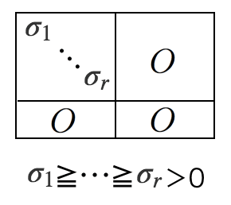

# Eiginvalue Problem

## Abstract
* PCAなどの基本となる固有値問題および, 関連する概念である対角化について理解する
* 特異値分解との関連性も理解する

## 1. What is "Eiginvalue Problem" ?
固有値問題とは, ある正方行列$A$に対して, 
```math
A \bm x = \lambda \bm x
```
が成り立つ固有ベクトル$\bm x$と固有値$\lambda$を求めることを示す. これは, $A$による線型変換の結果がスカラー倍($\lambda$)となるベクトル$\bm x$とスカラー$\lambda$の導出を意味する. 

これらの値は以下の性質を持つ. 
* $A$の次元数と同じだけ固有値が存在する
* $A$に対して, 固有値群と固有ベクトル群の方向は一意に定まり, 固有ベクトルの大きさは一意に定まらない (ここで固有値と固有ベクトルの方向は対応する)
* $A$が実対称行列およびエルミート行列(複素数に一般化したじつ対称行列)である場合, 固有値は必ず実数となり, 固有ベクトルは互いに直交する
* 固有値は$A$による$\bm x$の拡大率を示す (または, $A$における$\bm x$の方向の大きさ)
* 対角化と大きく関連しており, 全ての固有値を対角成分にとった行列$B$, それぞれの固有値に対応した場所に固有ベクトルを並べた行列$P$によって$A = P B P^{-1}$と分解することに相当する (ここで対角化は固有ベクトルが互いに線型独立である必要がある点に注意) 
* 固有ベクトルを基底として, 基底変換(回転)することによって, $A$は対角成分のみの行列となる(対角化)
* 対角化することで, $A$を, 大きさを意味するスカラー値と対応する基底ベクトルに分解できるため, $A$を意味のある値(共分散行列等)にすることで, 次元圧縮(削減)を行うことができる (PCAなど)

## 2. Singular value decomposition (SVD)
特異値分解は, 固有値問題(正方行列のみに適用可能)や対角化(正方行列かつ固有ベクトルが線型独立の時のみ可能)を一般化した概念であり, $m \times n$行列$A$を
```math
A = U \Sigma V
```
と分解することに相当する. ここで, $U$は$m\times m$の直行行列, $V$は$n\times n$の直行行列, $\Sigma$は以下の図のように, 左上を特異値(対角化における固有値と同一)を対角成分とした行列とし, それ以外を0とした$m\times n$の行列である. 


以下の性質を持つ. 
* 対角化同様, $\Sigma$は一意に定まり$U, V$は方向のみ一意に定まる
* 計算の効率化, 信号処理, 統計学, LSIで用いられる