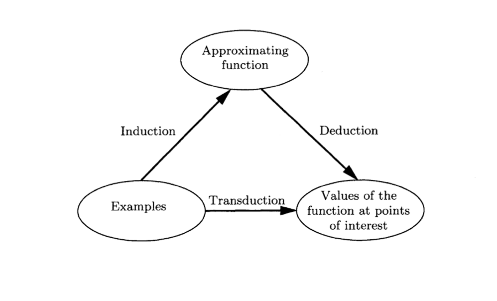

# TransductiveとInductive

## Abstract
* TransductiveとInductiveはどちらも日本語訳としては帰納的の意味を持つが, その意味は正反対である. 
* 論理学, 統計学, 機械学習において登場する概念である. 
* wikipedia[^1]の説明が非常に詳しい. 
* 機械学習におけるイメージは下図の通り

## Induction and Inductive Inference
Inductionは帰納的推論によって導かれた普遍的な仮説であり, 演繹推論における(広義の)公理として用いられる. Inductive inferenceとは, 複数の事例から帰納的に導かれた仮説を他の事例に適用することに他ならない. 
機械学習においては, 予測モデルの仮定(点と点を滑らかに補完する, ノードの不純度を減らす, など)をinductive biasと呼ぶが, これは訓練データによって変化することのないモデル間を差別する性質であるためである. 
論理学的に言えば, 人が死ぬという具体的事例を複数回観測することによって, (種もしくは概念としての)人はいづれ死ぬという一般論を獲得し, それを更に具体例に適用し, ソクラテスはいづれ死ぬという推論を行うことに相当する. 
つまり, 複数事例の中に(In)ある概念を抽出することにその本質がある. 

## Transductive and Transductive Inference
一方で, Transductionは, 同じく具体例の観測に基づくものの, 一般論についての推論を行わない. Transductionでは, ある事例についての推論を行う際, 特定の事例において観測された傾向を(全部, もしくは部分的に)と, 推論対象の事例の傾向を総合して推論を行う. つまり, Inductive inferenceでは一般論の適用による推論を行うのに対し, Transductive inferenceでは他の(少数)事例における部分的一般論と, 推論対象の傾向を比較することによって推論を行う. 
機械学習では, ラベルが不明なテストデータに対するクラスタリング結果に対し, ラベルが既知である訓練データとの位置関係からテストデータのラベルを推論することに相当する(これはテストデータの傾向と訓練データの傾向を比較しているだけであり, 説明変数と目的変数の一般的な関係性を推論しているのではない). ただ, 機械学習における翻訳タスクなどの文脈では, transductionは単なる変換の意味で使用されることもあるため注意が必要(Attention is All you needなど). 
論理学的に言えば, ２〜３人の人間が死ぬことを観測した際に, 見た目や住んでいる場所が似ているAさんはいづれ死ぬと推論し, 空高く飛んでいる鳥は見た目も住んでいるところも異なるため死なないと推論することに相当する(ここでは推論の精度について言及しているのではない). 
つまり, 特定の事例の傾向や性質を, 他の事例の推論の材料として伝播する(Trans)ことを意味する. 

[^1]: https://en.wikipedia.org/wiki/Transduction_(machine_learning)