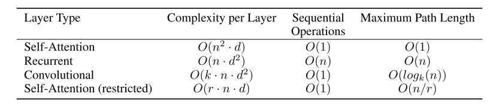

# Computer Vision

## 1. History[^1]

* [x] seq2seqモデルによる時系列解釈の実現  
RNNやその発展系であるLSTMは, 入力ベクトルの時系列性を認識し, 逐次的かつ再起的に学習を行うことで文脈の認識を可能とした. しかし, 学習に多大な時間が掛かること, 保持できる過去の情報が限られていることが課題として残った. また, 並列処理が可能なために, 計算効率において優れるCNNは, データの局所的な構造を捉えることはできる(耳, 目, 口元などパーツごとの特徴を認識する)が, 因果関係や位置関係といった時系列性を学習することはできない(局所構造と局所構造の関係性を学ぶことはできない). detectionにおいても, 画像の意味(画面構成, 位置情報, 文脈)を学習しているのではなく, フィルタ機能(局所構造の中で対象か対象でないかを判別)を学習していると考えられており, 自然言語処理や画像説明などの局所構造間の関係性が必要なタスクには適さない. これは, CNNや通常のFFNNにおいては, 独立したデータ点や局所構造と, ラベル情報の間の統計的関係を抽出するのであって, データ間や局所構造間の関係性を考慮することは無いためである. 
seq2seqモデルは, 一般的にエンコーダーとデコーダーによって構成される. エンコーダーは入力を抽象化する機能を持ち, 自然言語処理タスクにおいては, 自然言語をより抽象的な文脈情報(言語間で共通する意味特徴量)に変換する役割を持つ. デコーダーは特徴量の具体化を行う機能を持ち, 抽象的な意味情報を特的のドメインや具体例へと変換する役割を果たす(自然言語処理では, 言語間で共通する意味情報から各国の言語への変換など). 
具体的な課題点としては, エンコーダーによって生成されるconetxt vectorが固定長であり, context vectorが長くなるに応じて, 計算資源の増大, 計算効率の悪化, 文脈情報の忘却, が発生する点が挙げられる. 

* [x] Transformer[^2][^3][^4][^5][^6]  
自然言語処理には, CNNのような独立を仮定したデータやデータの局所構造のみを考慮した推論だけではなく, 局所構造間やデータ間に時系列性などの何らかの関係性(方向や位置など)を考慮した推論が必要である. 
前述のように, RNNやLSTMはある程度これを可能にするが, 計算効率の悪さや, 文脈情報の忘却が課題となった. 
Transformerは, データの逐次処理を行わないAttention機構を使用することで, 計算効率の悪さを大幅に解決した. 

計算効率の向上はより大規模なデータを用いた学習を可能とし, 結果的に飛躍的に精度が向上している. 

* [x] self attention
Attention機構は, 二種類の入力input, memoryを受け付ける. inputは全結合層によってquery(比較基準となる情報, 検索条件), memoryは全結合層によってkey(queryと比較して類似情報である重みを計算する索引), value(queryとkeyによって計算された類似情報を適用する比較対象, 検索対象)を示す. 
self attentionはinputとmemoryに同じ情報を入力する. これにより, 文章中の全ての単語が各単語に対して持つ言語上の類似情報を学習する. つまり, これによりある一定の言語体系をモデルに取り込むことができる. 
Transformerでは, このself attentionを並列に展開し, 何層も積み重ねることによって, 言語体系を習得する. 

* [x] BERTとGPT[^7]
BERTとGPTでは, 軽量なTransFormerの性質と無尽蔵に教師付きデータが手に入る自然言語データの特性を活かし, 膨大なデータによって事前に学習したモデルを, タスクに応じたデータで修正する事前学習方式が提案された. 

[^1]: https://aru47.hatenablog.com/entry/2020/08/18/175711

[^2]: query, key, valueが分かりやすく解説されている.
https://omathin.com/what-is-attention-1/

[^3]: 深層学習界の大前提Transformerの論文解説！  
Trasformerの全体像が詳しく分かりやすく説明されている。  
https://qiita.com/omiita/items/07e69aef6c156d23c538#151-%E3%83%87%E3%83%BC%E3%82%BF%E3%82%BB%E3%83%83%E3%83%88%E3%81%A8%E3%83%90%E3%83%83%E3%83%81

[^4]: Attention is all you needの解説  
Attentionとは何かを中心に説明されている。tranformer自体の解説は上記文献を参考にした方が良さそう。  
https://www.acceluniverse.com/blog/developers/2019/08/attention.html

[^5]: RNNからTransformerまでの歴史を辿る ～DNNを使ったNLPを浅く広く勉強～
https://aru47.hatenablog.com/entry/2020/08/18/175711

[^6]: Transformerを実装する
https://qiita.com/gensal/items/e1c4a34dbfd0d7449099

[^7]: BERTとGPT
https://japan.zdnet.com/article/35175167/2/

[^8]: Python(PyTorch)で自作して理解するTransformer
https://zenn.dev/yukiyada/articles/59f3b820c52571